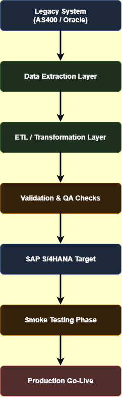

# Migration Architecture

This document describes the high-level architecture of a legacy system migration, from data extraction to production validation.

## High-Level Migration Flow

## Migration Stages

### 1. Legacy System

The legacy system is the original application, database, file storage or platform that contains the existing business data.

Examples include:

- Old ERP system
- SQL database
- Access database
- Excel-based process
- Mainframe system
- Legacy web application

The goal is to understand what data exists, how it is structured, and what business rules are hidden inside the old system.

### 2. Extraction

Extraction is the process of retrieving data from the legacy system.

This can be done through:

- Database exports
- CSV files
- API calls
- Reports
- Manual exports
- Backup files

QA focus:

- Confirm all expected records were extracted
- Check that no fields are missing
- Verify encoding, date formats and special characters
- Compare source record counts with extracted record counts

### 3. Transformation

Transformation changes the legacy data into the format required by the new target system.

Examples:

| Legacy Value | Target Value |
|---|---|
| 1 | Active |
| 0 | Inactive |
| PT | Portugal |
| NULL | Unknown |
| dd/mm/yyyy | yyyy-mm-dd |

QA focus:

- Validate field mappings
- Check business rules
- Confirm mandatory fields are populated
- Verify that dates, currencies and statuses are converted correctly

### 4. Validation

Validation confirms that the migrated data is complete, accurate and usable.

Typical validation checks include:

- Record count comparison
- Duplicate detection
- Mandatory field checks
- Field mapping verification
- Business rule validation
- Financial total reconciliation
- Relationship checks between records

QA focus:

- Compare source and target data
- Identify mismatches
- Document defects
- Confirm whether issues are blocking or non-blocking

### 5. Target System

The target system is the new platform where the migrated data will be used.

Examples include:

- New ERP
- New CRM
- Cloud application
- Modern database
- SaaS platform

QA focus:

- Confirm migrated data appears correctly
- Check that users can search and open records
- Verify that related data is connected correctly
- Confirm permissions and visibility rules

### 6. Smoke Testing

Smoke testing confirms that the target system works after the migration.

Example checks:

- User can log in
- User can search migrated records
- User can open customer/order/product data
- Main workflows still work
- Reports load correctly
- Permissions are correct

QA focus:

- Validate the most important business flows
- Confirm the system is stable enough for users
- Detect critical migration issues early

### 7. Production

Production is the final live environment where real users use the migrated system.

Before production, the team should confirm:

- Migration completed successfully
- Critical defects are resolved
- Business users approved validation results
- Rollback plan exists
- Smoke tests passed
- Support team is ready

QA focus:

- Provide final validation evidence
- Support go-live decision
- Monitor post-migration issues
- Document lessons learned

## QA Role in Migration Architecture

QA is responsible for ensuring that the migration is not only technically successful, but also business-valid.

A successful migration means:

- The right data was migrated
- The data was transformed correctly
- The target system works with migrated data
- Business users can continue their work
- Risks are known and controlled
- Evidence exists for go-live approval

---

## Architecture Decisions

The following architectural decisions were made to ensure a reliable, auditable, and low-risk migration process.

### Batch-Based Migration

The migration will be executed using scheduled batch jobs during a predefined maintenance window.

**Reason**

- Minimises business disruption
- Simplifies monitoring
- Allows controlled rollback if required
- Easier reconciliation after each batch

### ETL-Based Transformation

Data transformations are performed within the ETL process before loading into the target system.

**Reason**

- Centralises business rules
- Improves maintainability
- Reduces manual intervention
- Provides consistent transformation logic

### Validation Before Production

All validation activities are completed before the production cutover.

**Reason**

- Detects issues before users access the system
- Prevents incorrect business data entering production
- Reduces business risk

### Automated Reconciliation

Where possible, reconciliation activities are automated using scripts and SQL queries.

**Reason**

- Reduces manual effort
- Produces repeatable results
- Improves auditability
- Supports larger migration volumes

### Post-Migration Smoke Testing

Smoke testing is executed immediately after data loading.

**Reason**

- Confirms migrated data is usable
- Verifies critical business workflows
- Detects deployment issues before business users begin working

---

## Architecture Assumptions

This migration architecture assumes the following conditions are true.

| Assumption | Description |
|---|---|
| Source system availability | The legacy system remains available throughout extraction. |
| Read-only extraction | No changes are made to source data during migration. |
| Approved field mapping | Business users have approved the source-to-target mapping. |
| Production freeze | No application changes occur during the migration window. |
| ETL configuration | Transformation rules have been reviewed and tested. |
| Test environment | The target environment accurately reflects production. |
| Rollback plan | A tested rollback procedure exists before go-live. |
| Business availability | Business representatives are available to validate migrated data. |
| Infrastructure | Storage, network and database capacity are sufficient for migration. |
| Security | Required permissions exist for extraction, transformation and loading. |

---

## Common Migration Risks

Although a detailed risk assessment is documented separately, the architecture introduces several technical risks that must be considered throughout the migration.

| Risk | Potential Impact | Mitigation |
|---|---|---|
| Incomplete extraction | Missing business data | Record count validation |
| Incorrect transformations | Invalid business information | Mapping review and sample validation |
| Duplicate records | Data inconsistency | Duplicate detection rules |
| Character encoding issues | Corrupted text | UTF-8 validation |
| Performance bottlenecks | Extended migration window | Batch optimisation |
| Failed data load | Partial migration | Rollback procedures |
| Broken relationships | Invalid foreign keys | Referential integrity validation |
| Environment differences | Unexpected production issues | Production-like testing |

---

## Architecture Principles

- Data integrity takes priority over migration speed.
- Every transformation must be traceable to a documented business rule.
- Validation evidence must be retained for audit purposes.
- Migration should be repeatable and automated where possible.
- Rollback procedures must be tested before production deployment.
- Business approval is required before production go-live.

---

## QA Deliverables

The migration architecture is supported by several QA deliverables that provide planning, execution evidence, and final reporting.

| Deliverable | Repository Location |
|---|---|
| Migration Architecture | `docs/migration-architecture.md` |
| Test Strategy | `docs/TestStrategy.md` |
| Migration Lifecycle | `docs/migration-lifecycle.md` *(planned)* |
| Migration Risks | `docs/migration-risks.md` *(planned)* |
| Test Cases | `testing/TestCases.xls` |
| Validation Matrix | `validation/ValidationMatrix.xlsx` *(planned)* |
| Field Mapping | `validation/FieldMapping.xlsx` *(planned)* |
| Defect Log | `artifacts/DefectLog.xls` |
| Validation Report | `reports/ValidationReport.md` *(planned)* |
| Final Migration Report | `reports/FinalReport.md` |
