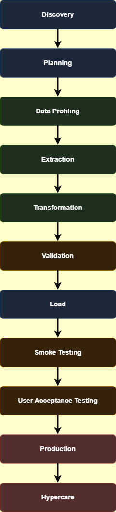
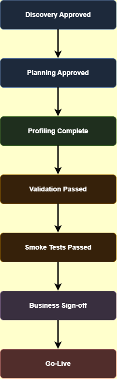

# Migration Lifecycle

This document describes the complete lifecycle of an enterprise data migration project, outlining the activities, deliverables, stakeholders, quality gates, and QA responsibilities associated with each phase of the migration.

---

## Purpose

The objective of this document is to define the sequence of activities required to successfully migrate customer master data from a legacy IBM AS400 platform to SAP S/4HANA.

A structured migration lifecycle ensures that every stage is completed in a controlled manner, reducing business risk and ensuring that migrated data is accurate, complete, and fully validated before production deployment.

Following a defined lifecycle also improves communication between technical teams, business stakeholders, and project management while providing clear quality gates throughout the migration process.

---

## Scope

### Included

- Project planning
- Data profiling
- Data extraction
- Data transformation
- Data validation
- Data loading
- Smoke testing
- User Acceptance Testing (UAT)
- Production deployment
- Hypercare support

### Excluded

- SAP functional configuration
- Infrastructure provisioning
- Development of new business functionality
- Performance tuning unrelated to migration
- Long-term operational support

---

## Migration Lifecycle Overview

---

# 1. Discovery

## Purpose

Understand the legacy system, business processes, stakeholders, and migration objectives.

## Activities

- Review existing documentation
- Identify business stakeholders
- Analyse legacy architecture
- Identify source systems
- Define migration scope

## Inputs

- Business requirements
- Existing documentation
- Legacy databases

## Outputs

- Discovery report
- Initial migration scope
- Stakeholder list

## Stakeholders

- Business Owner
- Solution Architect
- Project Manager
- QA Lead
- Technical Lead

## QA Responsibilities

- Review requirements
- Identify testing risks
- Identify data quality concerns
- Clarify acceptance criteria

## Deliverables

- Discovery Report
- Initial Risk Register

## Exit Criteria

- Scope approved
- Stakeholders identified
- Requirements understood

---

# 2. Planning

## Purpose

Create the migration strategy, schedule, and governance model.

## Activities

- Define migration approach
- Build project plan
- Estimate effort
- Identify dependencies
- Prepare environments

## Inputs

- Discovery outputs
- Business priorities

## Outputs

- Migration Plan
- Test Strategy
- Project Schedule

## Stakeholders

- Project Manager
- QA Lead
- Migration Team
- Business Representatives

## QA Responsibilities

- Review migration strategy
- Estimate testing activities
- Define validation approach

## Deliverables

- Migration Plan
- QA Strategy

## Exit Criteria

- Project plan approved
- Resources assigned

---

# 3. Data Profiling

## Purpose

Assess the quality of legacy data before migration begins.

## Activities

- Null value analysis
- Duplicate detection
- Invalid data identification
- Format validation
- Data completeness review

## Inputs

- Legacy database
- Source exports

## Outputs

- Data Profiling Report
- Data Quality Assessment

## QA Responsibilities

- Review profiling results
- Highlight anomalies
- Recommend cleansing activities

## Deliverables

- Data Profiling Report

## Exit Criteria

- Data quality understood
- Cleansing actions agreed

---

# 4. Extraction

## Purpose

Extract data from the legacy platform.

## Activities

- Export data
- Verify extraction completeness
- Create backups
- Generate extraction logs

## Inputs

- Legacy system

## Outputs

- CSV exports
- SQL dumps
- Extraction logs

## QA Responsibilities

- Verify record counts
- Validate extraction completeness
- Confirm file integrity

## Deliverables

- Extraction Report

## Exit Criteria

- All required datasets extracted

---

# 5. Transformation

## Purpose

Convert legacy data into the structure required by SAP S/4HANA.

## Activities

- Apply transformation rules
- Convert formats
- Standardise values
- Populate mandatory fields

## Inputs

- Extracted datasets
- Mapping specification

## Outputs

- Transformed datasets

## QA Responsibilities

- Verify mappings
- Validate transformation logic
- Review edge cases

## Deliverables

- Transformation Validation Report

## Exit Criteria

- Transformation rules successfully applied

---

# 6. Validation

## Purpose

Confirm that migrated data is accurate, complete, and business-ready.

## Validation Activities

- Record count comparison
- Duplicate detection
- Mandatory field validation
- Foreign key validation
- Business rule validation
- Date validation
- Character encoding validation
- Financial reconciliation
- Sample business verification
- Data completeness checks

## QA Responsibilities

- Execute validation scripts
- Compare source and target
- Document discrepancies
- Raise defects

## Deliverables

- Validation Matrix
- Validation Report
- Defect Log

## Exit Criteria

- Critical validation passed
- Business approval received

---

# 7. Target Load

## Purpose

Load transformed data into SAP S/4HANA.

## Activities

- Execute migration jobs
- Monitor logs
- Review rejected records
- Verify load completion

## QA Responsibilities

- Validate successful load
- Confirm rejected records
- Review migration logs

## Deliverables

- Load Report

## Exit Criteria

- Target system populated successfully

---

# 8. Smoke Testing

## Purpose

Confirm the migrated system is operational after loading.

## Typical Smoke Tests

- User login
- Customer search
- Customer details
- Reports
- User permissions
- Dashboard access

## QA Responsibilities

- Execute smoke test suite
- Raise critical defects
- Recommend go/no-go

## Deliverables

- Smoke Test Report

## Exit Criteria

- Critical business functions operational

---

# 9. User Acceptance Testing

## Purpose

Obtain business confirmation that migrated data supports operational activities.

## Activities

- Business validation
- Sample record review
- Process verification
- Sign-off

## QA Responsibilities

- Support business users
- Record defects
- Track approvals

## Deliverables

- UAT Report
- Business Sign-off

## Exit Criteria

- Business approval received

---

# 10. Production Deployment

## Purpose

Deploy the migrated solution into production.

## Activities

- Execute cutover
- Monitor migration
- Communicate status
- Validate production

## QA Responsibilities

- Support deployment
- Validate production environment
- Confirm migration success

## Deliverables

- Go-Live Report

## Exit Criteria

- Production stable

---

# 11. Hypercare

## Purpose

Provide intensive support immediately after go-live.

## Activities

- Incident management
- Production monitoring
- Defect prioritisation
- Business support
- Performance monitoring

## QA Responsibilities

- Validate fixes
- Confirm issue resolution
- Monitor production quality

## Deliverables

- Hypercare Report

## Exit Criteria

- System stable
- Support transitioned to operations

---

# Lifecycle Quality Gates

---

# Lifecycle Deliverables

| Phase | Deliverable |
|---|---|
| Discovery | Discovery Report |
| Planning | Migration Plan |
| Data Profiling | Data Profiling Report |
| Extraction | Extraction Report |
| Transformation | Transformation Validation Report |
| Validation | Validation Matrix |
| Target Load | Load Report |
| Smoke Testing | Smoke Test Report |
| UAT | Business Sign-off |
| Production | Go-Live Report |
| Hypercare | Hypercare Report |

---

# Roles and Responsibilities

| Role | Responsibility |
|---|---|
| Project Manager | Coordinates the migration project |
| Solution Architect | Defines migration architecture |
| ETL Developer | Implements extraction and transformation logic |
| QA Engineer | Validates migration quality |
| SAP Functional Consultant | Verifies business functionality |
| Business Owner | Approves migrated data |
| Database Administrator | Supports extraction and loading |

---

# Lessons Learned

- Begin data profiling as early as possible.
- Never assume legacy data is clean.
- Automate reconciliation wherever possible.
- Validate business rules, not only technical mappings.
- Always test rollback procedures.
- Engage business users throughout the migration lifecycle.

---

# Related Documentation

- `docs/migration-architecture.md`
- `docs/TestStrategy.md`
- `docs/migration-risks.md` *(planned)*
- `docs/validation-strategy.md` *(planned)*
- `validation/FieldMapping.xlsx` *(planned)*
- `validation/ValidationMatrix.xlsx` *(planned)*

---

# Revision History

| Version | Date | Author | Description |
|---|---|---|---|
| 1.0 | June 2026 | Lucinda Fonseca | Initial version |